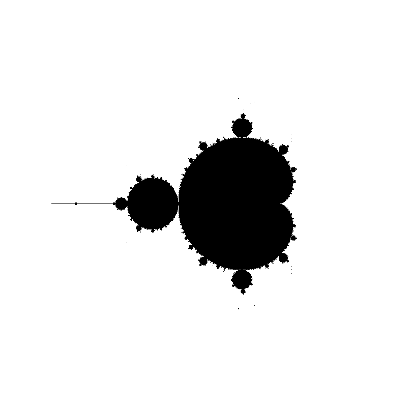

# pad-mandelbrot-set

Project for the subject **High Perforamance Processing** *(Processamento de Alto Desempenho -or PAD- in Portuguese)*. It consists on generating a Mandelbrot Set, but the key is that the generation must happen in a thread-based methodology, where each thread will be responsible for a given subset of the result.

## Running the set

Compile the program with:

> gcc -o mandelbrot-set mandelbrot-set.c

Run:

> ./mandelbrot-set

## Output

Once finished, the program will have generated a file called *output.ppm* which should look similar to the following:

